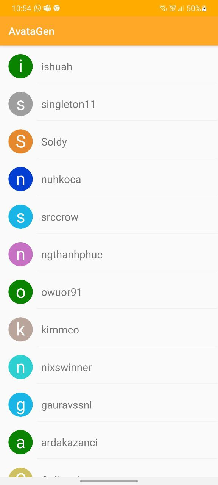

# AvatarImageGenerator

 [](https://app.circleci.com/pipelines/github/AmosKorir/AvatarImageGenerator/)
 [Download](https://bintray.com/skyways/AvatarGenerator/AvatarGenerator/1.4/link)

Generate first letter avatar Image like gmail's contact avatar. It generates an drawable that can be be set to an ImageView.
<table>
<tr>
<td>

</td>
<td>


</td>
</tr>
</table>

## Installation

**Note**: Before you can install AvatarImageGenerator you must first add JitPack as a maven repository in `settings.gradle`

```gradle
dependencyResolutionManagement {
    repositoriesMode.set(RepositoriesMode.FAIL_ON_PROJECT_REPOS)
    repositories {
        google()
        mavenCentral()
        maven { url 'https://jitpack.io' }
    }
}
```

Add the Following to your gradle file.

```gradle
implementation 'com.github.amoskorir:avatarimagegenerator:VERSION'
```

## Usage

New Builder pattern

```kotlin
 AvatarGenerator.AvatarBuilder(context)
                .setLabel(users[position].login)
                .setAvatarSize(120)
                .setTextSize(30)
                .toSquare()
                .toCircle()
                .setBackgroundColor(Color.RED)
                .build()
```

## Supports

Using glide or Picasso you can set the drawable to an imageView as a placeholder.

1. Picasso
2. Glide

**Picasso**

```java
 Picasso.get()
    .load("https://brokenfortest")
    .resize(50, 50)
    .placeholder(AvatarGenerator.avatarImage(this, 200, AvatarConstants.CIRCLE, "Android"))
    .into(imageView2)
```

**Glide**

```java
 Glide.with(this)
    .load("http://brokenfortest")
    .placeholder(AvatarGenerator.avatarImage(this, 200, AvatarConstants.CIRCLE, "Kotjav"))
    .into(imageView3)
```

**Without any Library**

```java
imageView.setImageDrawable(
    AvatarGenerator.avatarImage(
      this,
      200,
      AvatarConstants.RECTANGLE,
      "Skyways"
    )
```

**Shape**

1. Circle
2. Square

```java
.toSquare(),
.toCircle()

```
